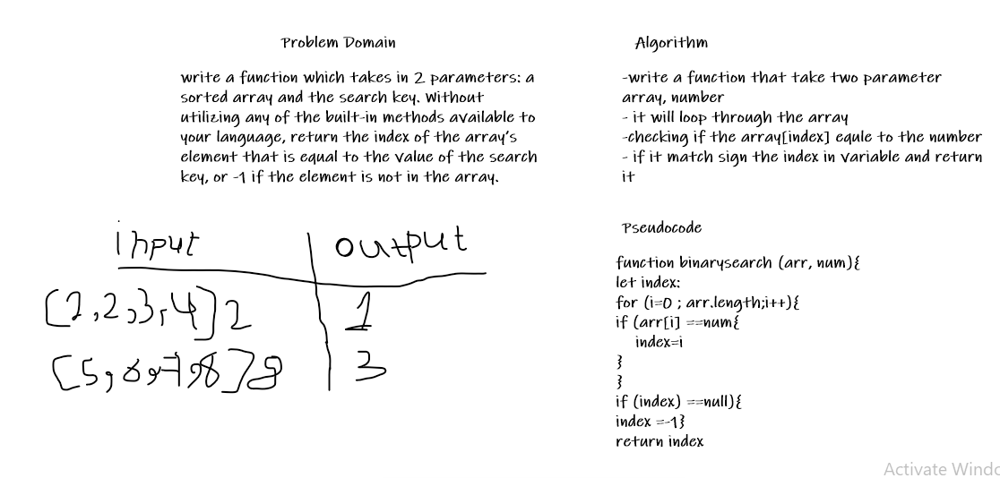

# Array-Binary-Search
Write a function called BinarySearch which takes in 2 parameters: a sorted array and the search key. Without utilizing any of the built-in methods available to your language, return the index of the array’s element that is equal to the value of the search key, or -1 if the element is not in the array.
Example : 
                  
	
  >Input  [2,4,6,-8], 6     
   Output  2

 >Input  [42,8,15,23,42], 16  
  Output	 -1

## Test Result

## Whiteboard Process

