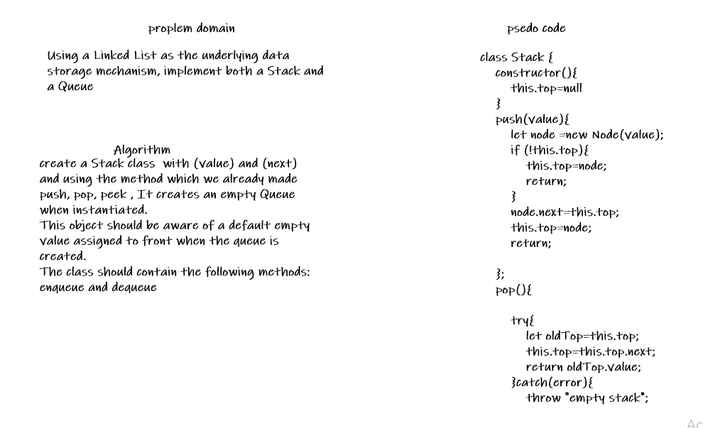

# Stacks and Queues

<!-- Description of the challenge -->

Using a Linked List as the underlying data storage mechanism, implement both a Stack and a Queue

## Whiteboard Process

<!-- Embedded whiteboard image -->

## Approach & Efficiency

<!-- What approach did you take? Discuss Why. What is the Big O space/time for this approach? -->

The challenge leans toward a solution close to a linked list. I implemented the stack and the queue in that way. And I also added a storage property in case we do not want to rely on the next property. Time and space complexity of O(1) was achieved on all methods on both classes.
