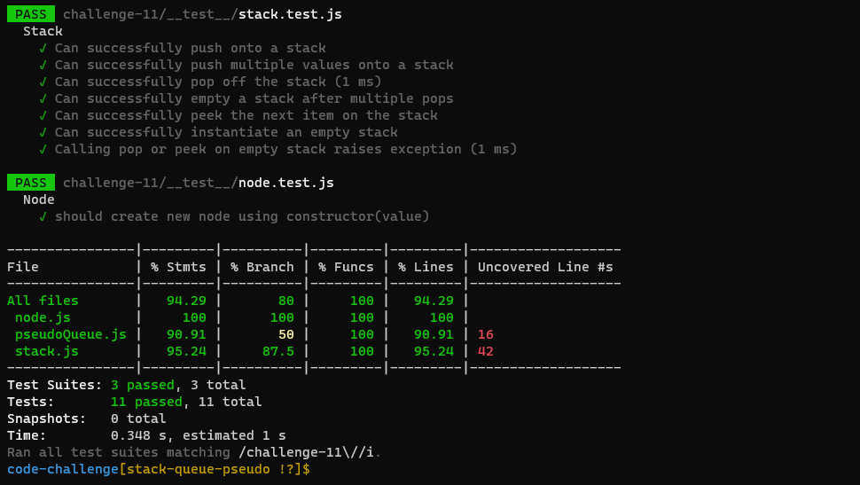

# Stacks Queues Pseudo

<!-- Description of the challenge -->

Implement a Queue using two Stacks.

## Whiteboard Process

<!-- Embedded whiteboard image -->

## Approach & Efficiency

<!-- What approach did you take? Discuss Why. What is the Big O space/time for this approach? -->

The challenge leans toward a solution close to implemented the stack and the queue in that way.

## Testing 

