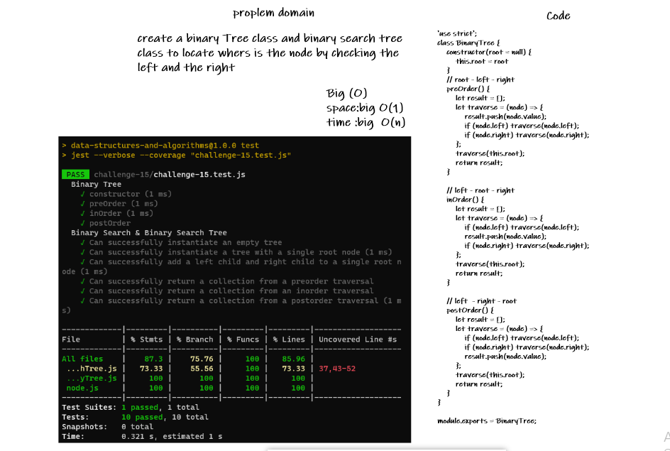

# Trees

<!-- Description of the challenge -->

Write Binary and Binary Search trees class with their methods.

## Whiteboard Process

<!-- Embedded whiteboard image -->

## Approach & Efficiency

<!-- What approach did you take? Discuss Why. What is the Big O space/time for this approach? -->

understood the problem first
I imagined how the results should be
I wrote the code
I made the tests