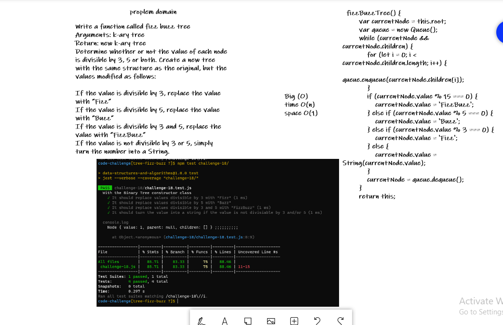

# Tree Fizz Buzz

<!-- Description of the challenge -->

Conduct “FizzBuzz” on a k-ary tree while traversing through it to create a new tree.

Set the values of each of the new nodes depending on the corresponding node value in the source tree.

## Whiteboard Process

<!-- Embedded whiteboard image -->

## Approach & Efficiency

<!-- What approach did you take? Discuss Why. What is the Big O space/time for this approach? -->

- Create a k-ary node: will need to include a children element that is an array of all the children nodes
- Create a k-ary instance
- Create method fizzBuzzTree
- This method needs to traverse the k-ary tree
- As it traverses, it should commit the FizzBuzz checks
- It should update the values appropriatly to Fizz, Buzz, FizzBuzz, or a string