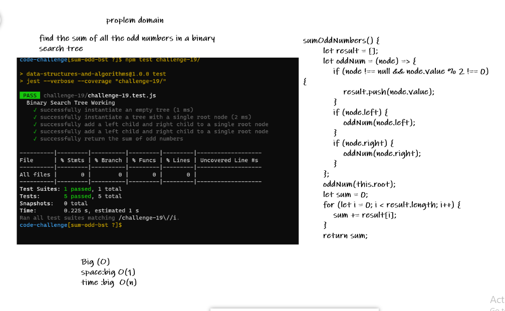

# Sum Odd BST

<!-- Description of the challenge -->

Sum of numbers in a binary tree

Find the sum of all the odd numbers in a binary search tree.

## Whiteboard Process

<!-- Embedded whiteboard image -->

## Approach & Efficiency

<!-- What approach did you take? Discuss Why. What is the Big O space/time for this approach? -->

Big O
Time <--- O(n)
Space <----- O(1)