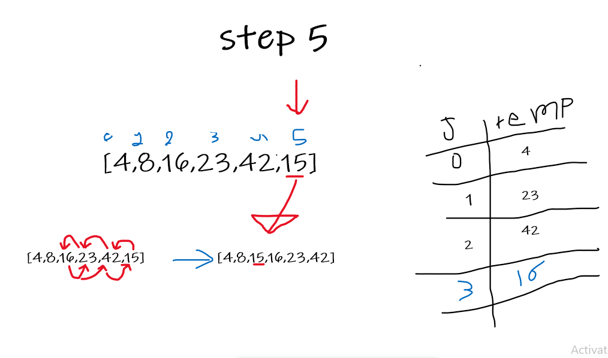

# Challenge Summary

trace the algorithm by stepping through the process with the provided sample array. Document your explanation by creating a blog article that shows the step-by-step output after each iteration through some sort of visual.

    ```
    InsertionSort(int[] arr)

        FOR i = 1 to arr.length

        int j <-- i - 1
        int temp <-- arr[i]

        WHILE j >= 0 AND temp < arr[j]
            arr[j + 1] <-- arr[j]
            j <-- j - 1

        arr[j + 1] <-- tem
    ```

## Whiteboard Process




## Test 
       

## Approach & Efficiency

we started from the seconed element in the array, and insted of moving the larger number to the end we draged the smaller one to the front under some conditions inside two nested loops.

- `Time Complexcity` : O(n) - since we have two nested loops situation.
- `Space Complexcity` : O(1) - it is only reasigning new values to the same three variables.

## Solution

calling the function with this `[8, 4, 23, 42, 16, 15]` will sort it to be this `[4, 8, 15, 16, 23, 42]`
the procedure is explained in details in the whiteboard.
you can find the tests in `__tests__/challenge-20.test.js`.