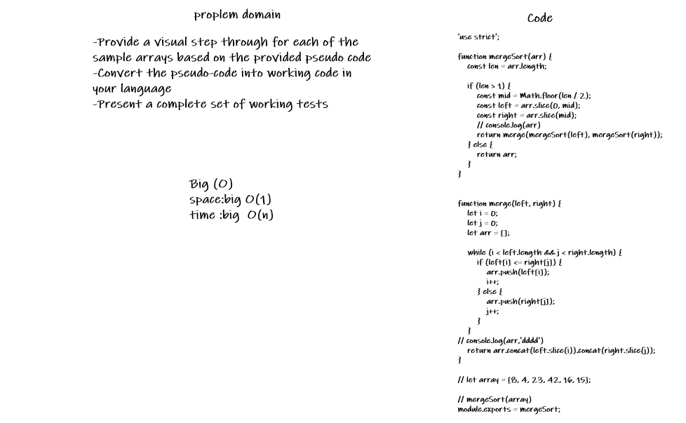
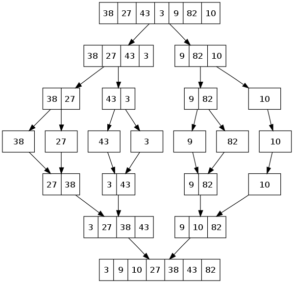
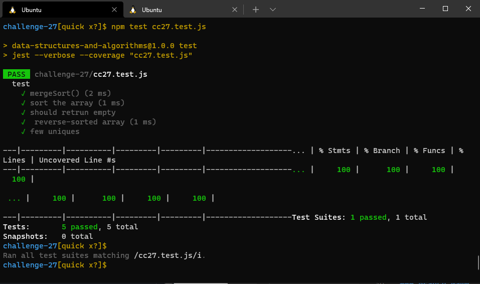

# Challenge 27 (Merge-Sort)

<!--  -->

 

 

### [git hub link](https://github.com/Laith-Hayajneh/401-data-structures-and-algorithms)

 

<!-- ## whitbord -->

<!--  -->

<!--  -->

## **Big O time** >>> `O(n log n)`

## **Big O space** >>> `O(n)`
## White Board

 
 

## **_Tracing_**

## Test

 
 

### Branch Name

> `MergeSort`

 

> Time taken :: 1 hour