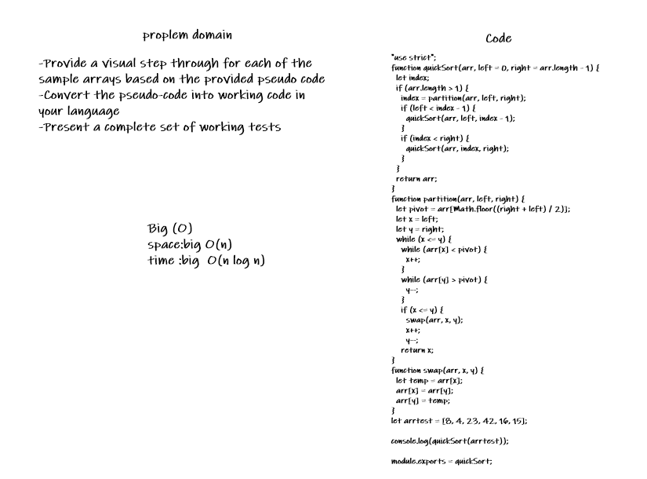
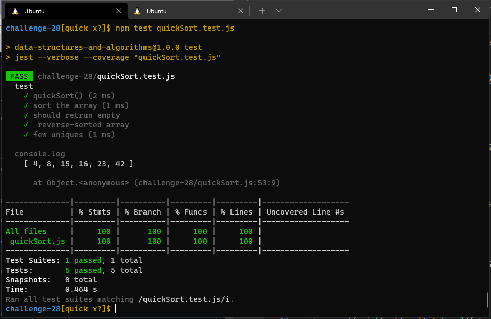

# Challenge 28 (Quick-Sort)

 

### [git hub link](https://github.com/Laith-Hayajneh/401-data-structures-and-algorithms)

 

## whitbord

<!--  -->

## **_Tracing_**

 
 

## Test

### Test by : npm test

 
 

### Branch Name

> `Quick`

 

> Time taken :: 1 hour 