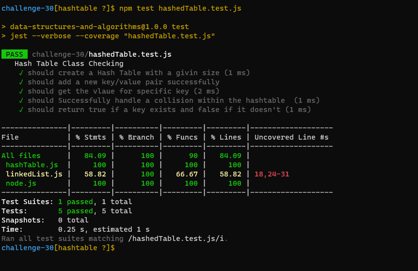

# Hashtables
<!-- Short summary or background information -->
-In computing, a hash table (hash map) is a data structure that implements an associative array abstract data type, a structure that can map keys to values. A hash table uses a hash function to compute an index, also called a hash code, into an array of buckets or slots, from which the desired value can be found.
## TEST:

## Challenge
<!-- Description of the challenge -->
Implement a Hashtable Class with the following methods:

- add

  - Arguments: key, value
  - Returns: nothing
  - This method should hash the key, and add the key and value pair to the table, handling collisions as needed.

- get

  - Arguments: key
  - Returns: Value associated with that key in the table

- contains

  - Arguments: key
  - Returns: Boolean, indicating if the key exists in the table already.

- hash

  - Arguments: key
  - Returns: Index in the collection for that key
## Approach & Efficiency
<!-- What approach did you take? Why? What is the Big O space/time for this approach? -->
Hash Table is a data structure which stores data in an associative manner. In a hash table, data is stored in an array format, where each data value has its own unique index value. Access of data becomes very fast if we know the index of the desired data.

Thus, it becomes a data structure in which insertion and search operations are very fast irrespective of the size of the data. Hash Table uses an array as a storage medium and uses hash technique to generate an index where an element is to be inserted or is to be located from.
## API
<!-- Description of each method publicly available in each of your hashtable -->