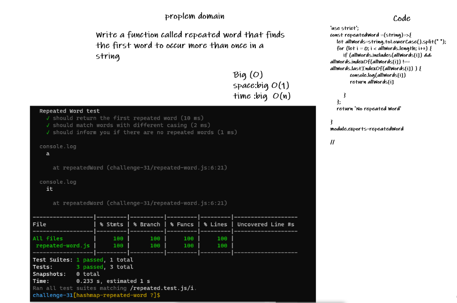

# Hashmap Repeated Word

<!-- Description of the challenge -->

Write a function called repeated word that finds the first word to occur more than once in a string
Arguments: string
Return: string

## Whiteboard Process

<!-- Embedded whiteboard image -->

## Approach & Efficiency

<!-- What approach did you take? Discuss Why. What is the Big O space/time for this approach? -->

Big O
Time <--- O(n)
Space <----- O(1)