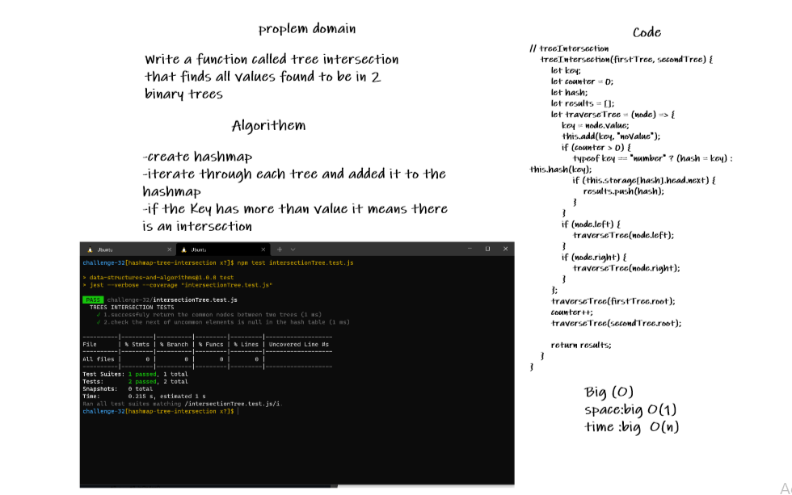

# Hashmap Tree Intersection

<!-- Description of the challenge -->

Find common values in 2 binary trees.

Find all values found to be in 2 binary trees

Write a function called tree intersection
Arguments: two binary trees
Return: array

## Whiteboard Process

<!-- Embedded whiteboard image -->

## Approach & Efficiency

<!-- What approach did you take? Discuss Why. What is the Big O space/time for this approach? -->

Big O
Time <--- O(n)
Space <----- O(1)